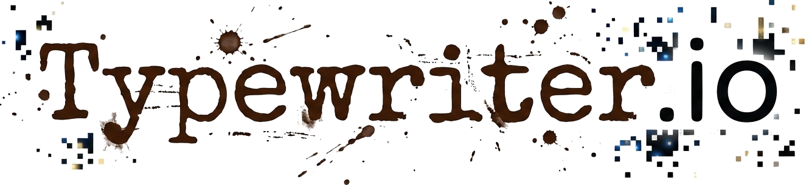

## Coding throw history

*Typewriter.io* is a unique educational platform for children and teenagers, where the technical world of web development meets the rich narratives of history. Our course, "Time Travel Through Web Development", follows a project-based learning approach: students master professional coding skills and immediately apply them to document and explore diverse historical topics.

#### The Journey: From Ink to Code

The curriculum is designed as a gradual progression:

- Building the Foundation: Students begin with the anatomy of HTML, using headings, paragraphs, and lists to give voice to historical events.
- Design & Aesthetics: Using a vintage-inspired palette (Beige, Brown, and Slate), learners apply CSS to create atmosphere and visual depth.
- Logic & Interactivity: Through JavaScript, students add dynamic layers to their stories, transforming static pages into interactive historical archives.

#### The Outcome

By the end of the course, each student develops a personal website. This final project is more than just a technical achievement; it is a creative portfolio that showcases their coding proficiency alongside their unique perspective on history through creative writing.
Typewriter.io empowers young creators to "type" the future by exploring the past, bridging the gap between traditional storytelling and modern digital craftsmanship.
